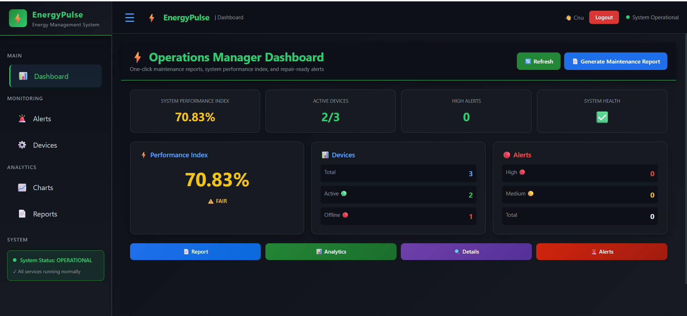
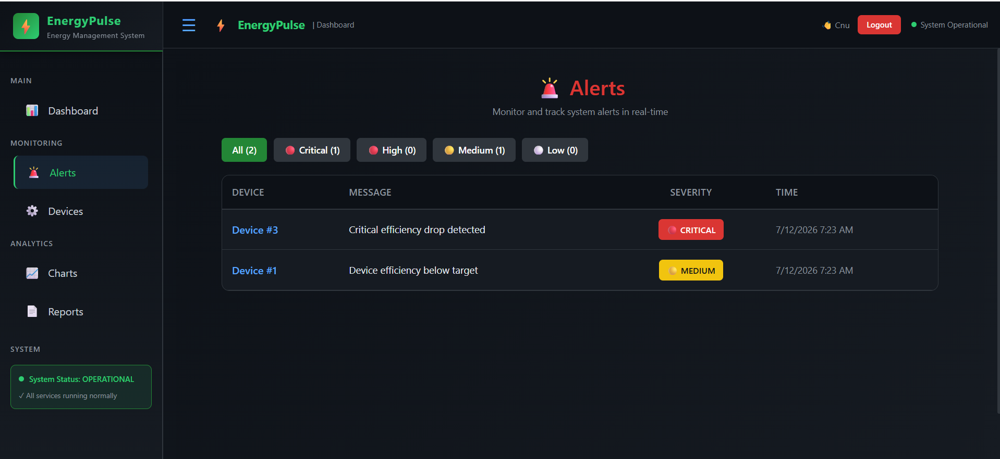
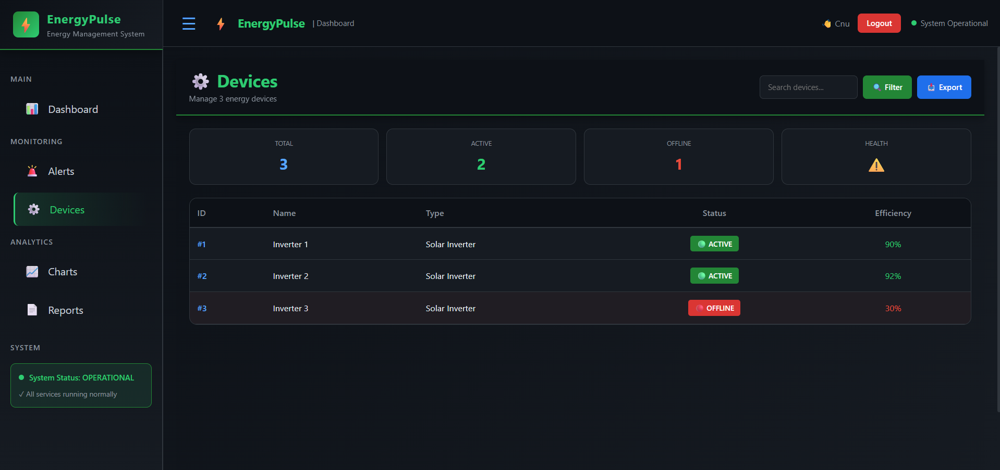
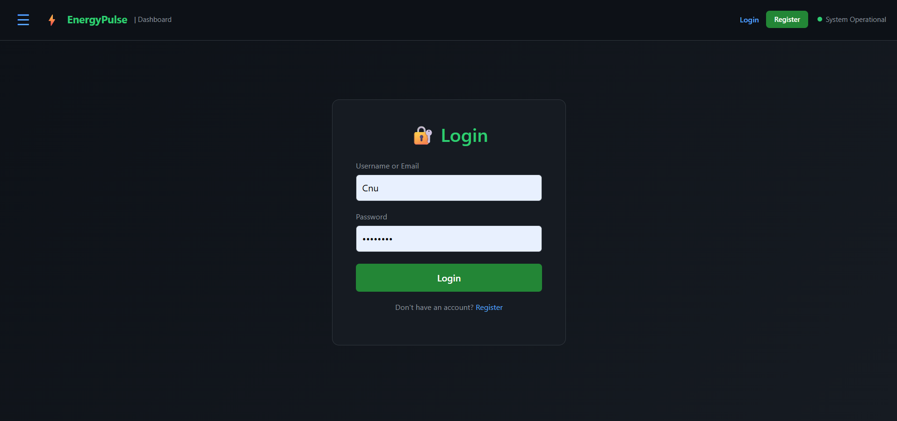
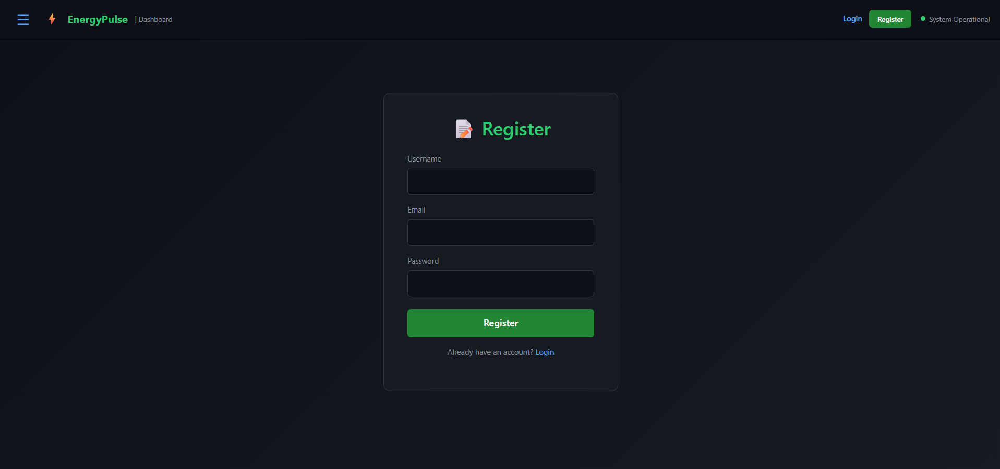

# ⚡ EnergyPulse - Energy Management System

[](https://dotnet.microsoft.com/)
[](https://dotnet.microsoft.com/apps/aspnet/web-apps/blazor)
[](LICENSE)

> **EnergyPulse** is a professional energy management platform that monitors solar farm performance, tracks devices, and generates maintenance reports. Built with ASP.NET Core 8, Blazor WebAssembly, and JWT Authentication.

---

## ✨ Features

| Feature               | Description                                               |
| --------------------- | --------------------------------------------------------- |
| 📊 **Dashboard**      | Real-time energy monitoring with System Performance Index |
| 🚨 **Alerts**         | Critical, High, Medium, Low severity alerts management    |
| ⚙️ **Devices**        | Monitor and manage energy devices                         |
| 📄 **Reports**        | Generate professional maintenance reports (PDF/TXT)       |
| 🔐 **Authentication** | Secure JWT-based login/registration                       |
| 📱 **Responsive**     | Works on all devices (mobile-first)                       |
| 🐳 **Docker**         | Containerized for easy deployment                         |

---

## 🛠️ Technology Stack

| Layer              | Technology                 |
| ------------------ | -------------------------- |
| **Backend**        | ASP.NET Core 8.0           |
| **Frontend**       | Blazor WebAssembly 8.0     |
| **Database**       | SQL Server                 |
| **ORM**            | Entity Framework Core 8.0  |
| **Authentication** | JWT (JSON Web Tokens)      |
| **PDF Generation** | iText7                     |
| **Styling**        | Custom CSS with dark theme |

---

## 📸 Screenshots

### Dashboard



### Alerts Management



### Devices Overview



### Report Page


### Login Page



### Register Page



---

## 🚀 Quick Start

### Prerequisites

- [.NET 8 SDK](https://dotnet.microsoft.com/en-us/download/dotnet/8.0)
- [SQL Server Express](https://www.microsoft.com/en-us/sql-server/sql-server-downloads)
- [Visual Studio 2022](https://visualstudio.microsoft.com/) or VS Code
- [Docker Desktop](https://www.docker.com/products/docker-desktop/) (Optional)

---

## 📁 Project Structure

EnergyPulse/ # Backend API (.NET 8)
├── Controllers/ # API Endpoints
├── Models/ # Database Models
├── Services/ # Business Logic
├── Data/ # Database Context
├── Migrations/ # Database Migrations
├── DTOs/ # Data Transfer Objects
├── appsettings.json # Configuration
└── Program.cs # Startup Configuration

EnergyPulse.UI/ # Frontend (Blazor WebAssembly)
├── Pages/ # UI Pages
│ ├── Dashboard.razor # Main Dashboard
│ ├── Charts.razor # Energy Charts
│ ├── Devices.razor # Device Management
│ ├── Alerts.razor # Alert System
│ └── Report.razor # Reports & Export
├── Layout/ # Layout Components
├── Services/ # UI Services (Auth, API)
├── wwwroot/ # Static Files
└── Program.cs # Client Configuration

## 🏃 Running the Application

### **Method 1: Using Visual Studio 2022 (Easiest)**

#### **Step 1: Open Solution**

1. Open Visual Studio 2022
2. File → Open → Project/Solution
3. Navigate to: `C:\Users\kanup\source\repos\EnergyPulse\`
4. Select `EnergyPulse.sln`
5. Click Open

#### **Step 2: Set Startup Projects**

1. Right-click **Solution 'EnergyPulse'** in Solution Explorer
2. Select **Set Startup Projects**
3. Choose **Multiple startup projects**
4. Set **Action** for both projects:
   - `EnergyPulse` → **Start**
   - `EnergyPulse.UI` → **Start**
5. Click **OK**

#### **Step 3: Run Application**

1. Debug → Start Debugging (or **F5**)
2. **Two windows will open:**
   - **API Server**: `https://localhost:7109`
   - **Blazor App**: `https://localhost:7110`

---

### **Method 2: Using Command Line**

#### **Step 1: Navigate to Project Root**

```bash
cd C:\Users\kanup\source\repos\EnergyPulse
```
